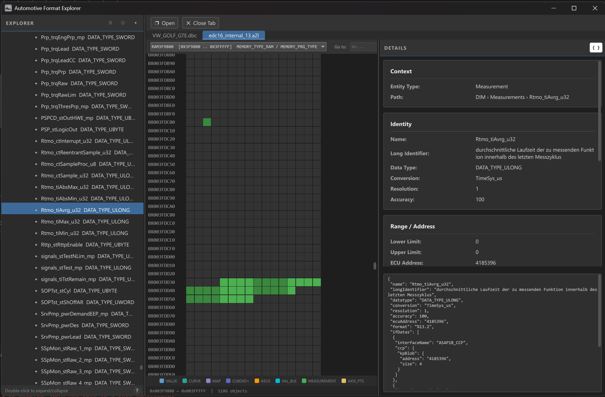
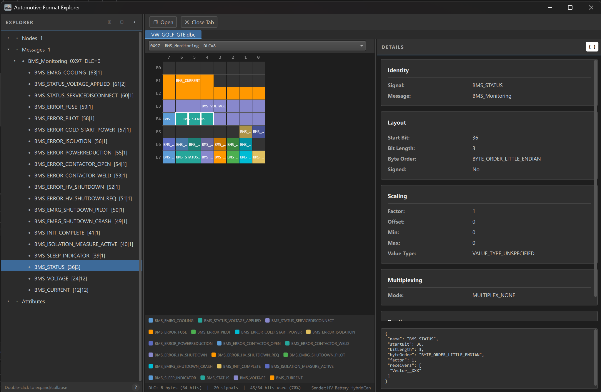
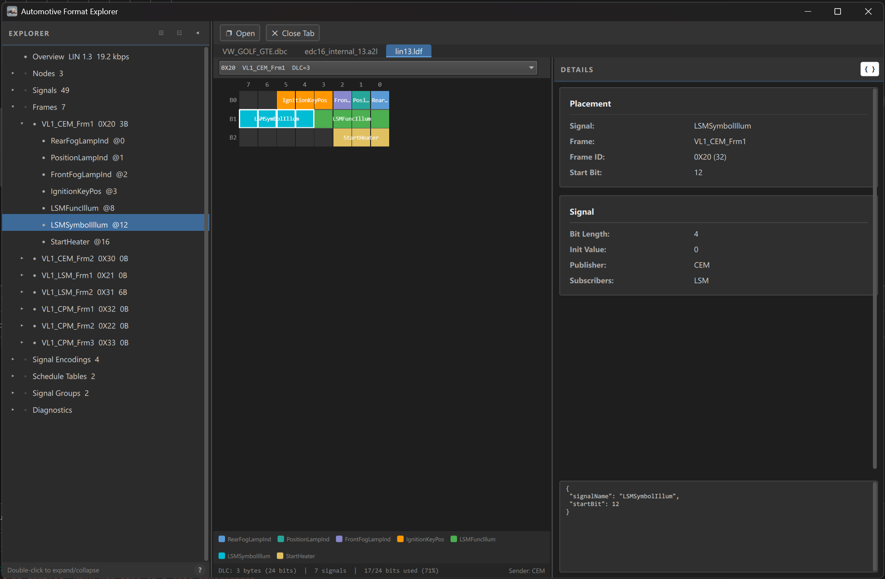

# Automotive Format Explorer

[](https://github.com/dnbmch/automotive-format-explorer/actions/workflows/ci.yml)

A desktop tool for inspecting **A2L**, **DBC**, and **LDF** automotive files. Built with Qt/QML and C++17 by [Danube Mechatronics](https://danube-mechatronics.com).

> **[Download latest release](https://github.com/dnbmch/automotive-format-explorer/releases/latest)**
>
> **Windows**: extract the zip and run `automotive-format-explorer.exe`
> **Linux**: `chmod +x *.AppImage && ./automotive-format-explorer-*.AppImage`

---

## Screenshots

### A2L -- ECU Memory Map


### DBC -- CAN Signal Map


### LDF -- LIN Signal Map


---

## Features

### Supported Formats

| Format | Standard | Typical Use |
|--------|----------|-------------|
| **A2L** | ASAM MCD-2MC (ASAP2) | ECU calibration and measurement definitions |
| **DBC** | Vector CANdb | CAN bus message and signal databases |
| **LDF** | LIN Consortium | LIN bus network description |

### Tree Navigation

Browse every parsed entity in a structured tree with expand/collapse, keyboard shortcuts, and search-by-click. Supported entity types include:

- **A2L**: Modules, Measurements, Characteristics, Axis Points, Compu Methods, Record Layouts, Units, Functions, Groups, Typedef Characteristics/Structures/Axes, Instances, Variant Coding, XCP and CCP protocol summaries
- **DBC**: Messages, Signals, Nodes, Value Tables, Attribute Definitions, Environment Variables, Signal Groups
- **LDF**: Frames, Signals, Nodes (Master/Slave), Schedule Tables, Signal Encoding Types, Signal Representations

### Detail Panel

Structured property cards for every entity type, with key fields, references, and metadata. Toggle **raw JSON** view to inspect the underlying protobuf data directly.

### Memory View (A2L)

Visual hex grid of ECU memory segments. Each byte is color-coded by the object that occupies it:

| Color | Object Type |
|-------|-------------|
| Blue | VALUE (scalar calibration) |
| Teal | CURVE (1D lookup) |
| Purple | MAP (2D lookup) |
| Indigo | CUBOID+ (multi-dimensional) |
| Orange | ASCII (string parameter) |
| Cyan | VAL_BLK (value array) |
| Green | MEASUREMENT (runtime signal) |
| Gold | AXIS_PTS (standalone axis) |

- Segment selector with automatic fallback when no segments are defined
- Hover tooltips with name, type, address, and computed size
- Jump-to-address input field
- Configurable bytes-per-row (8 / 16 / 32)
- Alternating shades to distinguish adjacent same-type objects
- Tiered size calculation (exact for VALUE/CURVE/MAP, approximate for complex record layouts)

### Signal Map (DBC / LDF)

Bit-level visualization of CAN and LIN message payloads. Each signal is rendered at its exact bit position with correct big-endian or little-endian layout.

- Color-coded signals with alternating shades
- Multiplexor group filtering
- Overlap detection
- Hover tooltips with factor, offset, range, and unit
- Keyboard navigation

### Bidirectional Selection

Click a tree node and the center view scrolls to it with a highlight flash. Click a cell in the memory or signal view and the tree scrolls to that entity with the detail panel updating simultaneously.

### Multi-Tab

Open multiple files side by side. Async file loading keeps the UI responsive for large files.

---

## Parser Libraries

The explorer is built on top of three parser libraries published by [Danube Mechatronics](https://danube-mechatronics.com):

| Format | Library | Releases |
|--------|---------|----------|
| A2L | [a2l-parser-lib](https://github.com/dnbmch/a2l-parser-lib) | [Releases](https://github.com/dnbmch/a2l-parser-lib/releases) |
| DBC | [dbc-parser-lib](https://github.com/dnbmch/dbc-parser-lib) | [Releases](https://github.com/dnbmch/dbc-parser-lib/releases) |
| LDF | [ldf-parser-lib](https://github.com/dnbmch/ldf-parser-lib) | [Releases](https://github.com/dnbmch/ldf-parser-lib/releases) |

Each library parses its respective format into Protocol Buffer messages. The explorer downloads prebuilt release artifacts automatically at CMake configure time -- no manual setup required.

The parser libraries are **dual licensed: GPL-2.0 or Commercial**. See their repositories for details, or contact [Danube Mechatronics](https://danube-mechatronics.com) for commercial licensing.

---

## Building from Source

### Prerequisites

- Qt 6.5+ (`Core`, `Concurrent`, `Gui`, `Qml`, `Quick`, `QuickControls2`, `QuickDialogs2`)
- CMake 3.21+
- Protobuf development package (visible to CMake via CONFIG or MODULE mode)
- Internet access at configure time (parser libraries are fetched from GitHub releases)

### Build

```bash
cmake -B build -G Ninja
cmake --build build
```

Parser library versions are pinned in `CMakeLists.txt`. To override:

```bash
cmake -B build -DA2L_PARSER_VERSION=v0.2.0 -DDBC_PARSER_VERSION=v0.2.0 -DLDF_PARSER_VERSION=v0.3.0
```

### Platform Notes

- **Windows (MinGW)**: Primary development platform. Backends are shared libraries loaded at runtime.
- **Linux**: Backends are linked statically into the executable. Tested on Ubuntu 24.04 with system protobuf.

## Documentation

- [docs/arch/architecture.md](docs/arch/architecture.md) — process layout, plugin loading, DocumentSession contract, NodeRegistry lifecycle, startup splash + DWM cloak.
- [docs/arch/adapter_contract.md](docs/arch/adapter_contract.md) — how to add a new format adapter.
- [docs/ref/memory_view.md](docs/ref/memory_view.md) — A2L memory grid visual + interaction reference.
- [docs/ref/signal_map.md](docs/ref/signal_map.md) — DBC/LDF signal grid visual + interaction reference.
- [docs/ref/keyboard.md](docs/ref/keyboard.md) — application + grid keyboard shortcuts.
- [docs/ref/cmake_build_system.md](docs/ref/cmake_build_system.md) — `fetch_parser_lib` mechanics, MSYS2 deploy, shared-vs-static backend model.
- [roadmap.md](roadmap.md) — direction and planned work.
- [project_status.md](project_status.md) — current state of play.
- [docs/backlog.md](docs/backlog.md) — known issues / planned changes.

## License

GPL-3.0-or-later. See [LICENSE](LICENSE).

The parser libraries this app loads are dual-licensed (GPL-2.0 or Commercial); they are linked via their public release artifacts, not via source dependency.
