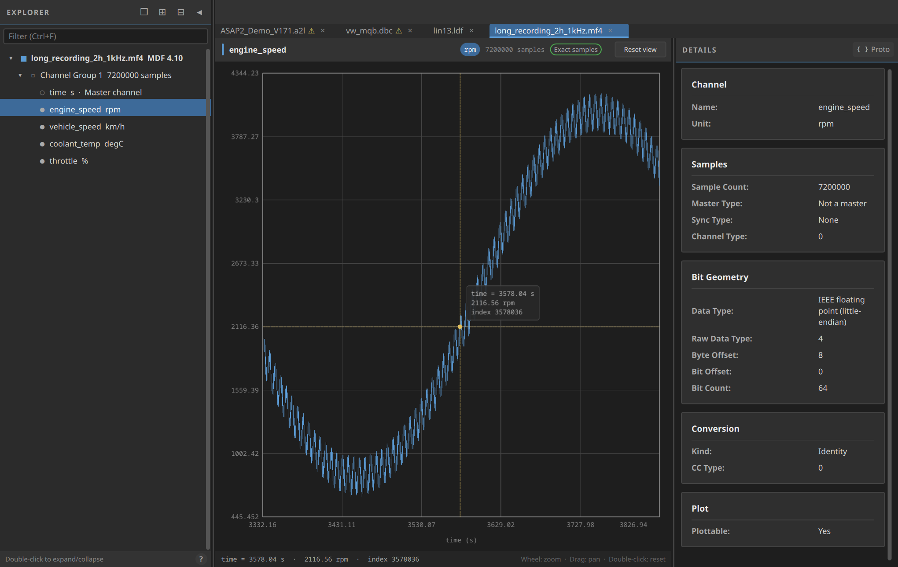

# Automotive Format Explorer

A desktop tool for inspecting **A2L**, **DBC**, **LDF**, and **MDF4** automotive files. Built with Qt/QML and C++17 by [Danube Mechatronics](https://danube-mechatronics.com).

> **[Download latest release](https://github.com/dnbmch/automotive-format-explorer/releases/latest)**
>
> **Windows**: extract the zip and run `automotive-format-explorer.exe`. The download is unsigned, so
> SmartScreen may say "Windows protected your PC": choose **More info → Run anyway**.
> **Linux**: `chmod +x *.AppImage && ./automotive-format-explorer-*.AppImage` on Ubuntu 24.04 or newer,
> or another distribution with glibc 2.38 or newer. Older distributions on request.
>
> The latest release opens A2L, DBC, LDF and MDF4 files.

---

## Screenshots

### A2L -- ECU Memory Map


### DBC -- CAN Signal Map


### LDF -- LIN Signal Map


### MDF4 -- Signal Plot


---

## Features

### Supported Formats

| Format | Standard | Typical Use |
|--------|----------|-------------|
| **A2L** | ASAM MCD-2MC (ASAP2) | ECU calibration and measurement definitions |
| **DBC** | Vector CANdb | CAN bus message and signal databases |
| **LDF** | LIN Consortium | LIN bus network description |
| **MDF4** | ASAM MDF 4 | Measurement recordings and physical signal data |

### Tree Navigation

Browse every parsed entity in a structured tree with expand/collapse, keyboard shortcuts, and a live filter box (`Ctrl+F`) that narrows the tree to matching names — matches keep their ancestors and children visible, so filtering to a message keeps its signals in view. Supported entity types include:

- **A2L**: Modules, Measurements, Characteristics, Axis Points, Compu Methods, Record Layouts, Units, Functions, Groups, Typedef Characteristics/Structures/Axes, Instances, Variant Coding, XCP and CCP protocol summaries
- **DBC**: Messages, Signals, Nodes, Value Tables, Attribute Definitions, Environment Variables, Signal Groups
- **LDF**: Frames, Signals, Nodes (Master/Slave), Schedule Tables, Signal Encoding Types, Signal Representations
- **MDF4**: Channel Groups and Channels, each channel showing its unit and whether it is plottable (sources, storage layouts, conversions, masters, and unsupported-feature reasons live in the detail panel)

### Detail Panel

Structured property cards for every entity type, with key fields, references, and metadata. Toggle **raw JSON** view to inspect the underlying protobuf data directly.

### Memory View (A2L)

Visual hex grid of ECU memory segments. Each byte is color-coded by the object that occupies it:

| Color | Object Type |
|-------|-------------|
| Blue | VALUE (scalar calibration) |
| Teal | CURVE (1D lookup) |
| Purple | MAP (2D lookup) |
| Indigo | CUBOID+ (multi-dimensional) |
| Orange | ASCII (string parameter) |
| Cyan | VAL_BLK (value array) |
| Green | MEASUREMENT (runtime signal) |
| Gold | AXIS_PTS (standalone axis) |

- Segment selector with automatic fallback when no segments are defined
- Hover tooltips with name, type, address, computed size, record layout, and conversion
- Diagonal red hatching on bytes claimed by more than one object
- Click-drag byte-range selection with a status-bar readout (range, byte count, objects in range)
- Jump-to-address input field
- Configurable bytes-per-row (8 / 16 / 32)
- Alternating shades to distinguish adjacent same-type objects
- Tiered size calculation (exact for VALUE/CURVE/MAP, approximate for complex record layouts)

### Signal Map (DBC / LDF)

Bit-level visualization of CAN and LIN message payloads. Each signal is rendered at its exact bit position with correct big-endian or little-endian layout, except that ISO 17987 big-endian LIN signals are drawn little-endian ([BL-V3](docs/backlog.md#bl-v3-iso-17987-big-endian-lin-signals-are-drawn-little-endian)).

- Color-coded signals with alternating shades
- Multiplexor group filtering
- Overlap detection
- Hover tooltips with factor, offset, range, and unit
- Keyboard navigation

### Signal Plot (MDF4)

Select a numeric MDF4 channel to plot its physical values against its time
master, or against the sample index when its group has none. File open remains
metadata-only. A worker scans the whole channel into an overview of at most 4,096
bins, so every sample of a long recording is represented; zooming in reads the exact
samples of the view, at most 4 Mi at a time. Results stay within a 256 MiB allowance
per open file.

- The overview draws each column's minimum to maximum, never joining columns as if
  they were samples; exact samples are drawn as a line, or as columns when denser
  than the pixels
- Hover reports a column's time and sample range with its extrema, or an exact
  sample's time, value and index
- Wheel zoom around the pointer, drag pan, and reset to the whole recording
- Progress while reading; a newer selection or view cancels obsolete reads
- A recording that ends early is marked incomplete with the samples it holds
- Unsupported channels stay browsable and explain why they are not plottable
- A group's master channel is listed as its axis rather than offered as a signal

### Bidirectional Selection

Click a tree node and the center view scrolls to it with a highlight flash. Click a cell in the memory or signal view and the tree scrolls to that entity with the detail panel updating simultaneously.

### Multi-Tab

Open multiple files side by side. Async file loading keeps the UI responsive for large files. Each tab keeps its own tree filter.

### Bundled Samples

One sample file per format, the `mdf4-writer`-authored `.mf4` recording included, ships with the app ([samples/](samples/)); when no file is open, the sidebar offers them as one-click "open a sample" links. Provenance and licenses: [samples/SAMPLES.md](samples/SAMPLES.md). The DBC sample deliberately demonstrates the diagnostics badge — it carries one dangling `VAL_` entry the parser reports as DROPPED.

### Command Line

`automotive-format-explorer [files...]` opens each named file in its own tab. With `--check` it opens the named files, or every bundled sample when none is named, and exits with 0 when each opened and drew without a QML warning, 1 otherwise, reporting one line per file on stderr. The release builds run it as their launch test.

---

## Parser Libraries

The explorer consumes four parser libraries from [Danube Mechatronics](https://danube-mechatronics.com), all of them published:

| Format | Library | Availability |
|--------|---------|--------------|
| A2L | [a2l-parser-lib](https://github.com/dnbmch/a2l-parser-lib) | [Releases](https://github.com/dnbmch/a2l-parser-lib/releases) |
| DBC | [dbc-parser-lib](https://github.com/dnbmch/dbc-parser-lib) | [Releases](https://github.com/dnbmch/dbc-parser-lib/releases) |
| LDF | [ldf-parser-lib](https://github.com/dnbmch/ldf-parser-lib) | [Releases](https://github.com/dnbmch/ldf-parser-lib/releases) |
| MDF4 | [mdf4-parser-lib](https://github.com/dnbmch/mdf4-parser-lib) | [Releases](https://github.com/dnbmch/mdf4-parser-lib/releases) |

Each library parses its format into Protocol Buffer messages. Explorer links canonical CMake targets supplied by the source workspace or by complete installed parser packages. Configuration is offline; package acquisition is an explicit step.
The parser libraries are **dual licensed: GPL-2.0 or Commercial**. See their repositories for details, or contact [Danube Mechatronics](https://danube-mechatronics.com) for commercial licensing.

---

## Building from Source

### Prerequisites

- Qt 6.5+ (`Core`, `Concurrent`, `Gui`, `Qml`, `Quick`, `QuickControls2`, `QuickDialogs2`)
- CMake 3.21+
- Protobuf development package (visible to CMake via CONFIG or MODULE mode)
- zlib development package (for MDF4 compressed data blocks)
- Complete installed parser packages with matching compiler/runtime and protobuf versions, or the sibling source workspace

### Build with installed packages

```bash
cmake -S . -B build-package -G Ninja -DAFF_PARSER_MODE=PACKAGE \
  -DCMAKE_PREFIX_PATH="/path/to/parser-prefix;/path/to/Qt"
cmake --build build-package
ctest --test-dir build-package --output-on-failure
```

The parser prefix holds the complete install archives of the four parser `-lib`
releases, unpacked into one directory
([build reference](docs/ref/cmake_build_system.md#parser-dependencies)).

### Build from sibling sources

From the `automotive-file-formats` workspace root:

```bash
cmake -S . -B build-workspace -G Ninja -DAFF_BUILD_EXPLORER=ON \
  -DAFF_PARSER_MODE=SOURCE -DCMAKE_PREFIX_PATH="/path/to/Qt"
cmake --build build-workspace
ctest --test-dir build-workspace --output-on-failure
```

The workspace adds each parser once. Its current sources and generated headers
are used directly through the same public targets as installed packages.

### Platform Notes

- Every format backend is linked statically into the one executable on all platforms.
- **Windows (MinGW)**: Primary development platform. The executable runs with the UTF-8 code page, so files under non-ASCII directory and file names open on Windows 10 version 1903 or later.
- **Linux**: Built and tested on Ubuntu 24.04 with system protobuf. The AppImage needs glibc 2.38 or newer and runs on X11 and, through Xwayland, on Wayland desktops.

## Documentation

- [docs/arch/architecture.md](docs/arch/architecture.md) — process layout, format composition and load shutdown, tabs and tree navigation, DocumentSession contract, MDF4 reads, node keys, startup splash + DWM cloak.
- [docs/arch/adapter_contract.md](docs/arch/adapter_contract.md) — how to add a new format adapter.
- [docs/ref/memory_view.md](docs/ref/memory_view.md) — A2L memory grid visual + interaction reference.
- [docs/ref/signal_map.md](docs/ref/signal_map.md) — DBC/LDF signal grid visual + interaction reference.
- [docs/ref/signal_plot.md](docs/ref/signal_plot.md) — format-neutral time-series plot reference.
- [docs/ref/keyboard.md](docs/ref/keyboard.md) — application + grid keyboard shortcuts.
- [docs/ref/cmake_build_system.md](docs/ref/cmake_build_system.md) — canonical parser dependencies, runtime dependency closure, static backend composition.
- [docs/ref/release_packaging.md](docs/ref/release_packaging.md) — Windows and Linux package paths, launch gates, release publish gating.
- [roadmap.md](roadmap.md) — direction and planned work.
- [project_status.md](project_status.md) — current state of play.
- [docs/backlog.md](docs/backlog.md) — known issues / planned changes.

## License

GPL-3.0-or-later. See [LICENSE](LICENSE).

The parser libraries this app loads are dual-licensed (GPL-2.0 or Commercial); source and installed builds retain the parser libraries' licensing terms.
